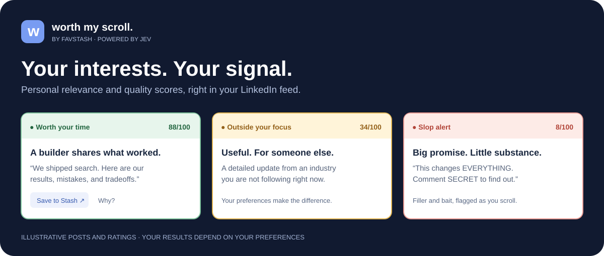
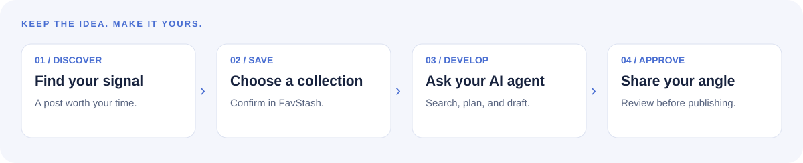

# Worth My Scroll — a personal AI filter for your LinkedIn feed

**Less noise. More people and ideas worth your time.**

Worth My Scroll is a Chrome extension that scores LinkedIn posts against **your interests**, highlights useful content, and helps you spot generic filler and engagement bait as you scroll. Powered by **Jev**, with a direct TypeSafe connection or **Vercel AI Gateway**.



[Get started](#get-started) · [Save ideas to FavStash](#turn-a-good-post-into-your-next-idea) · [Privacy](docs/PRIVACY.md) · [MIT license](LICENSE)

## A LinkedIn feed that makes sense for you

Your next useful connection might be a founder sharing a hard lesson, a builder showing a working demo, or someone solving a problem you care about. Describe what you want to see. Worth My Scroll gives each visible post a personal relevance and quality rating.

| Highlight | What it tells you |
| --- | --- |
| 🟢 **Worth your time** | Strong match for your interests, with useful substance. |
| 🟡 **Mixed signal / Outside your focus** | Some overlap, an uncertain payoff, or a topic outside your current interests. |
| 🔴 **Slop alert** | Heavy filler, empty hype, or engagement bait with little substance. |

Lightly tinted headers and matching post borders make ratings easy to scan. Open **Why?** for a radar chart covering personal fit, substance, value, slop, engagement bait, and potential for an original post of your own.

**You choose what matters.** Change your preferences whenever your focus changes: finding collaborators, learning a skill, following your industry, or looking for your next content idea. Posts stay in your feed; the extension adds context to help you decide what to read.

## Tell it what is worth your time

Type your preferences directly in the popup. For example:

> I want founder updates, builders shipping products with AI, and practical implementation details. Prioritize real demos, experiments, results, and honest tradeoffs. Skip vague motivation, exaggerated AI hype, and comment-to-unlock teasers.

Make it your own: designers, researchers, marketers, recruiters, and founders can all follow different signals. The popup includes a **Copy prompt** button if you want ChatGPT to help write your preferences. **No OpenAI API key is needed.**

## Turn a good post into your next idea

Found something worth keeping? Click **Save to Stash** beside the rating. It opens [FavStash](https://www.favstash.app) with the public post link and a short inspiration note already supplied. Choose your collection and confirm **Save item** there.

If you need to log in or sign up first, FavStash carries the pending link through that flow. No copy-paste checklist, separate FavStash API key, or extension panel inside the web app.



FavStash brings saved content from **LinkedIn, Instagram, TikTok, and YouTube** into a unified stash. Connect your AI agent through FavStash’s **MCP** integration to:

- **Find it later:** ask your agent to search saved content by keywords or topic.
- **Develop your own angle:** use your stash as reference material for an original post grounded in your experience.
- **Plan and draft:** turn scattered inspiration into a content plan and reviewable drafts.
- **Publish with your approval:** use FavStash’s supported publishing connections to schedule or post to connected social accounts after you approve the content and timing.

The extension handles discovery and the link handoff. FavStash and your connected agent handle saving, search, and the later content workflow. Availability depends on your FavStash account and connected platforms.

On suitable posts, a **FavStash recreate score** highlights potential for an original angle. It is an inspiration signal, not a prediction of going viral.

## Get started

You need Chrome, Node.js 22 or later, and your own **TypeSafe/Jev** or **Vercel AI Gateway** API key with evaluation access and available credits. The extension currently installs locally; it is not yet on the Chrome Web Store.

### 1. Build the extension

```sh
git clone https://github.com/alisadiq-ai/worth-my-scroll.git
cd worth-my-scroll
npm ci
npm run build
```

### 2. Load it in Chrome

Open `chrome://extensions`, enable **Developer mode**, click **Load unpacked**, and select the project's `dist` folder.

### 3. Make it yours

Open the extension popup, paste your API key, and describe your interests. The provider is detected from supported key formats; unfamiliar formats show a provider selector. Review the data notice, then click **Test & start scoring**.

Open or refresh your LinkedIn feed and scroll. You can pause scoring, edit preferences, and check usage from the same popup.

**Updating an existing install?** Rebuild, click **Reload** on Worth My Scroll in `chrome://extensions`, then refresh LinkedIn. This replaces the feed script as well as the popup.

## What does scrolling 1,000 posts cost?

**About $0.04 for 1,000 new posts** at the project's September 23, 2026 Gateway pricing snapshot, assuming roughly 1,000 input tokens per post. Actual cost depends on post length, preferences, provider pricing, and account billing.

The popup estimates your cost per 1,000 posts from successful scoring requests. Cached ratings avoid repeat evaluation calls. A daily request limit and pause switch give you control over usage. Connection tests also call the provider, but are not included in the scrolling counter.

This is an estimate, not a fixed price. Check your provider's current pricing before adding credits.

## Your key. Your preferences. Your control.

- Your API key stays in this Chrome profile and is sent only to the selected model provider for authentication. Session-only storage is the default; remembering it locally is optional.
- Preferences and cached ratings are not synced through Chrome Sync.
- Enabling scoring sends visible post text and your preferences to Jev, directly or through Vercel AI Gateway. Processing is **not offline**.
- There is no extension-operated backend, analytics, or telemetry.
- **Save to Stash** sends the selected public link and inspiration note to FavStash. It never sends your Jev key.
- The extension does not like, comment, follow, message, or publish on your behalf.

Read the [full privacy details](docs/PRIVACY.md).

## Frequently asked questions

### Does this detect whether a post was written by AI?

No. The slop rating looks for low-value filler, hype, and withheld payoff. AI-assisted writing can be useful; human writing can be empty. Scores are subjective judgments against your preferences, not proof of authorship or fact-checking.

### Does it analyze images or videos?

It scores visible post text. It does not watch videos, inspect images, expand hidden text, or fetch linked articles. A great visual demo with a short caption can therefore be underrated.

### Do I need FavStash to score my feed?

No. Feed scoring needs only your Jev or Vercel Gateway connection. A FavStash account is needed when you choose to save content there.

### Does it work with a direct Jev key?

Both direct TypeSafe/Jev and Vercel AI Gateway adapters are included. Gateway has been verified with live requests. The direct adapter has contract tests; live verification with a direct TypeSafe key is still pending.

### Is this an official LinkedIn extension?

No. This is an independent, experimental hobby project. LinkedIn's markup and policies can change, which may affect compatibility. See LinkedIn's [third-party software policy](https://www.linkedin.com/help/linkedin/answer/a1341387).

## Build with us

Bug reports and focused improvements are welcome. For setup checks, scoring details, and development commands, see [Development](docs/DEVELOPMENT.md). For what has actually been tested, see [Validation](docs/VALIDATION.md).

## License

[MIT](LICENSE) © 2026 Ali Sadiq. Built by [FavStash](https://www.favstash.app).

Sora is bundled under the [SIL Open Font License](public/fonts/OFL.txt). Third-party names and trademarks belong to their respective owners; this project does not imply endorsement by LinkedIn, TypeSafe, or Vercel.
